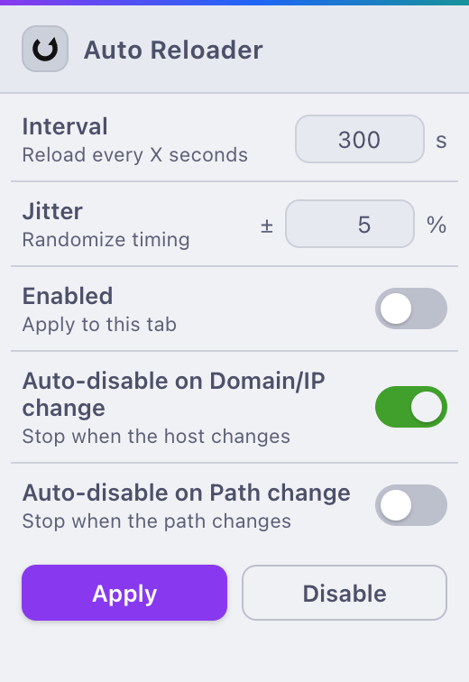
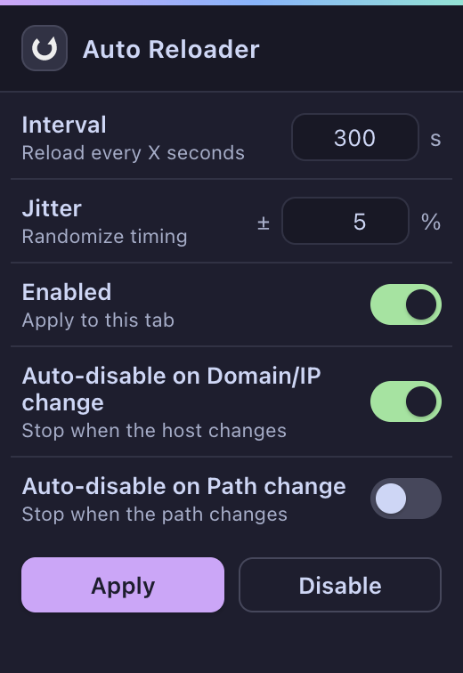

# Auto Reloader (Chrome Extension)

Reload the current page every **X** seconds (default **300**) with an optional **± jitter %** (default **5%**).  
Nice-to-have extras:

- **Per-tab enable/disable** (persists while the tab lives, across reloads)
- **Countdown badge** on the toolbar icon
- **Auto-disable on Domain/IP change** (default **ON**) — stops reloading when the page navigates to a different host
- **Auto-disable on Path change** (default **OFF**) — also stops when the path changes on the same host
- **Pause on interaction** — any key press or mouse click pauses the countdown; it resumes after **1 minute** of inactivity
- Optional **random jitter**: reload at a random time in the range `X*(1±P%)`

Manifest V3, no background polling: the content script keeps time so it’s reliable even when the MV3 service worker sleeps.

---
# Previews

---

## Quick install (from GitHub ZIP)

1. **Download the ZIP**
   - Visit: `https://github.com/seganku/auto-reloader`
   - Click the green **Code** button → **Download ZIP**.

2. **Unzip** the archive
   - Extract it somewhere convenient (you’ll get a folder like `auto-reloader-main/`).
   - Ensure this folder contains a `manifest.json` file at its top level.

3. **Load it into Chrome**
   - Open `chrome://extensions/`.
   - Turn on **Developer mode** (top-right).
   - Click **Load unpacked** → select the *folder that contains* `manifest.json` (e.g., `auto-reloader-main/`).

4. **Pin the extension**
   - Click the puzzle-piece icon in the toolbar.
   - Pin **Auto Reloader** so its badge is visible.

> **Note:** Chrome extensions cannot run on certain pages (e.g., `chrome://*`, the Chrome Web Store, some PDF/internal pages). The popup will still open, but the content script cannot be injected there.

---

## Using Auto Reloader

1. Open the page you want to auto-reload.
2. Click the **Auto Reloader** icon.
3. Set:
   - **Interval (seconds)** — default **300**
   - **Jitter (±%)** — default **5**
   - **Enabled for this tab** — on by default
   - **Auto-disable on Domain/IP change** — default **ON**
   - **Auto-disable on Path change** — default **OFF**
4. Click **Apply** — changes only take effect when you click Apply.

A small badge will count down (e.g., `59s`, `2m5s`, `1h0m7s`). When it hits zero, the page reloads and the countdown restarts.

**Pro tip:** If you just reloaded the extension on `chrome://extensions/`, you no longer need to refresh the target page first — the popup auto-injects the content script into the active tab when you click **Apply** (unless it’s a restricted page).

---

## Troubleshooting

- **“Load unpacked” is greyed out** → Toggle **Developer mode** on in `chrome://extensions/`.
- **Badge shows but the number doesn’t decrease** → Click **Apply** again. If you previously had the extension open, the content script might not have been injected yet for that tab.
- **It won’t run on a given page** → Some pages (e.g., `chrome://*`, Web Store, certain PDFs) block content scripts by design.
- **It stops after navigating** → That's **Auto-disable on Domain/IP change** (and optionally **Path change**) doing its job. Turn those options off if you want it to continue across navigations.
- **Reload happens while I'm using the page** → That's expected: interacting with the page pauses the countdown, and it resumes automatically after 1 minute of inactivity.

---

## Permissions (why they’re needed)

- `activeTab`, `tabs`, `scripting` — allow the popup to inject the content script into the current tab and message it.
- `storage` — persist per-tab settings (interval/jitter/toggles) so reloads survive page reloads.
- `host_permissions: "<all_urls>"` — let the content script run on most sites (subject to Chrome’s restricted pages list).
